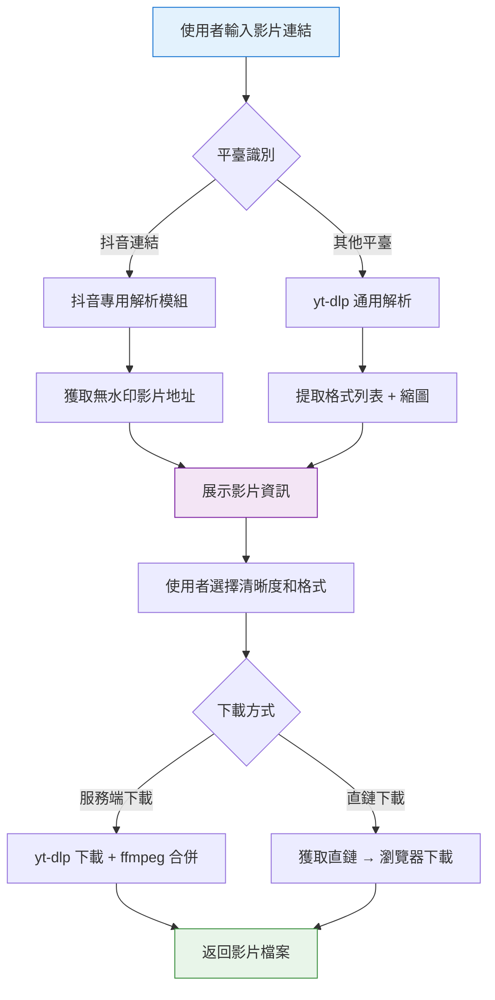
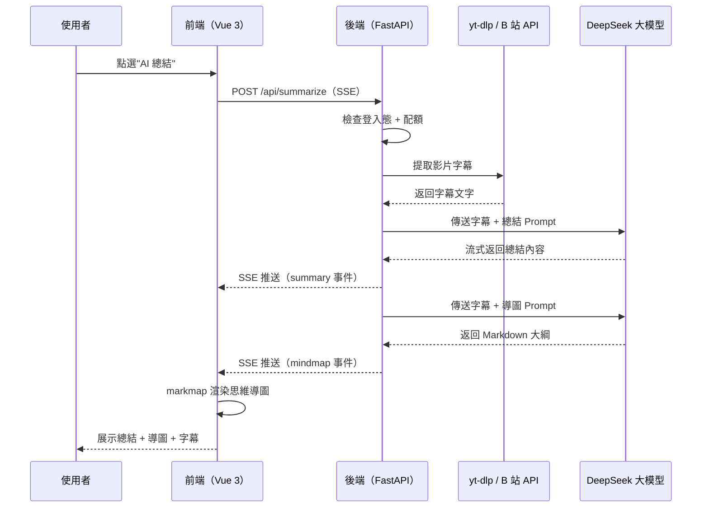

# Cursor - AI 萬能影片下載總結器專案實戰

這是一套以 AI 程式設計實戰為核心的專案教程，基於 Vue 3 + FastAPI + yt-dlp + DeepSeek + Stripe，用 AI 程式設計的方式從 0 到 1 開發一個《AI 萬能影片下載總結器》，帶你親身體驗 Vibe Coding 的完整工作流，學會用 AI 快速做出一個能上線變現的實用工具！

專案程式碼免費開源：https://github.com/liyupi/free-video-downloader

完整影片教程 + 文字教程（預計 3 ~ 7 天學完）：https://www.codefather.cn/course/2027618983506640897

## 專案介紹

很多同學都有下載儲存影片到本地的需求，比如離線觀看技術教程、或者備份自己上傳的作品。但很多平臺要麼不支援直接下載、要麼限制清晰度、要麼需要安裝各種客戶端，非常不方便。

更進一步，如果能在下載前快速瞭解一個長影片的核心內容，比如看一個 2 小時的技術分享，先看到 AI 總結的大綱和要點，就能判斷值不值得花時間看完整影片，大幅提升學習效率。

更重要的是，這個專案不只是做一個工具，而是帶大家學習一種 **利用開源專案快速解決問題** 的方法。不需要從零造輪子，站在巨人的肩膀上，用 AI 程式設計快速完成封裝和擴充套件，就能快速打造出能力更強的 SaaS 平臺。

這就是 AI 萬能影片下載總結器的起點：輸入一個影片連結，工具自動解析影片資訊，支援從 B 站、YouTube、抖音等 **1800+** 平臺下載影片，同時提供 **AI 影片總結**（摘要 + 思維導圖 + 問答），還整合了 **使用者認證** 和 **Stripe 國際支付** 能力，是一個真正能上線變現的產品。

**一個連結搞定影片下載 + AI 總結，學習效率翻倍！**

## 專案功能演示

1）多平臺影片解析和下載

輸入主流影片平臺的影片連結，系統自動解析影片標題、封面、時長，並提供多種清晰度和格式供使用者選擇下載。基於 yt-dlp 開源專案，支援 **1800+** 網站，涵蓋 B 站、YouTube、抖音等主流平臺。針對抖音等需要特殊處理的平臺，開發了專用解析模組，無需使用者提供 Cookie 即可獲取無水印影片。

2）AI 影片總結摘要

解析影片後，系統自動提取字幕並呼叫 DeepSeek 大模型進行內容分析，流式輸出影片的總結摘要，Markdown 格式排版精美，幫助使用者快速瞭解影片核心要點。

3）AI 生成思維導圖

基於影片內容自動生成互動式思維導圖，幫助使用者一目瞭然地掌握影片結構。支援全屏展示、縮放拖拽檢視完整內容，還可以匯出高畫質 PNG 和 SVG 格式圖片。

4）AI 影片問答

使用者可以基於影片內容進行自由問答，AI 會根據字幕文字給出針對性的回答，輔助深度學習。

5）字幕匯出

支援下載 SRT、VTT、TXT 等多種格式的字幕檔案，方便使用者自行整理和學習。

6）使用者註冊登入 + 會員許可權

支援郵箱 + 密碼註冊登入，基於 JWT 實現無狀態認證。免費使用者每天可使用 3 次 AI 總結，VIP 會員不限次數。

7）Stripe 國際支付

整合 Stripe 國際支付平臺，支援信用卡等多種支付方式，使用者可一鍵開通 VIP 會員，解鎖無限 AI 總結次數。

## 專案收穫

本專案選題新穎，緊跟 AI 程式設計時代，以 **實用工具 + 商業變現** 為導向，區別於增刪改查的爛大街專案。你不是在寫程式碼，而是在用 AI 做一個真正有價值的工具，還能上線賺錢。

專案內容精煉，**不到一週就能學完**，快速掌握 AI 程式設計的核心工作流：需求分析 → 方案設計 → 編碼開發 → 測試驗證 → 功能擴充套件 → SEO/GEO 最佳化 → 支付整合，讓你真正體驗 AI 程式設計從開發到變現的完整閉環。

從這個專案中你可以學到：

- 如何用 AI 程式設計從 0 到 1 開發一個完整的前後端專案？
- 如何安裝和使用 MCP、Agent Skills 增強 AI 能力？
- 如何利用開源專案實現多平臺影片下載？並針對特定平臺進行適配？
- 如何透過 DeepSeek 大模型實現 AI 影片總結、思維導圖和問答？
- 如何使用 SSE 實現流式資料傳輸？
- 如何基於 JWT 實現使用者認證和許可權控制？
- 如何整合 Stripe 國際支付，實現收款和 Webhook 回撥？
- 如何進行 SEO 和 GEO 搜尋最佳化，讓更多人看到你的產品？
- 如何利用 Cursor SubAgents 並行開發多個功能？

## 功能梳理

該專案功能豐富，涵蓋影片解析下載、AI 智慧總結、使用者認證、會員支付、SEO/GEO 最佳化 5 大模組，20+ 功能點，覆蓋了從工具開發、AI 應用到商業變現的完整產品閉環。

## AI 程式設計開發流程

這個專案遵循最主流的 AI 程式設計專案開發流程：

第一步，給 AI 寫一段需求描述提示詞，讓它幫我做競品分析和方案設計。還裝了 Firecrawl MCP 抓取網頁內容做競品調研，Context7 MCP 自動拉取最新的技術文件，確保 AI 寫的程式碼不過時。

第二步，人工確認方案。前端用 Vue 3 + Tailwind CSS，後端用 Python 的 FastAPI，影片下載核心是 yt-dlp 這個 14 萬 Star 的開源專案。確認沒問題後再讓 AI 動手寫程式碼。

第三步，啟動開發。AI 會先規劃任務列表，一步步完成前後端開發。寫完還會自己開啟瀏覽器測試。

第四步，測試驗證。人工驗收，發現問題再反饋給 AI 修復。

跑通核心業務流程之後，就要持續迭代最佳化。比如抖音影片下載需要 Cookie，使用者自己獲取太麻煩了，AI 自己找到了一個無需 Cookie 的抖音解析方案，直接整合進來了。還有 SSE 流式傳輸的時候前端 Markdown 渲染出來的內容是亂的，提示 AI 檢查後端返回的資料編碼方式才找到了問題根源。

後面做擴充套件功能的時候，還用了 SubAgents 子代理，讓 AI 同時並行開發 Markdown 渲染最佳化、思維導圖全屏展示和字幕下載三個功能，效率直接翻倍。每做完一個階段都用 Git 提交程式碼，新開 AI 對話視窗的時候，把文件丟給 AI 就能快速找回記憶接著幹。

建議每做完一個功能就用 Git 提交程式碼，防止 AI 後面改著改著搞崩了。如果上下文太長了，AI 容易斷片兒，就新開一個對話視窗，把需求文件和方案文件丟給 AI，讓它重新分析已有程式碼找回記憶。

## 核心業務流程

整個影片下載流程：使用者輸入連結 → 平臺分流（抖音 / 通用） → 解析影片資訊 → 使用者選擇格式和清晰度 → 服務端下載 → 返回檔案。

AI 總結的核心流程：提取字幕 → 呼叫 DeepSeek 流式生成摘要 → 生成思維導圖 → 支援問答互動。

## 技術選型

本專案以 Python 後端 + Vue 前端為核心，前後端分離，涵蓋多平臺影片下載、AI 大模型內容總結、SSE 流式傳輸、JWT 認證、Stripe 國際支付、SEO/GEO 搜尋最佳化等實用技術，一個專案即可掌握工具類產品從開發到變現的核心技術棧。

後端：FastAPI（Python 非同步 Web 框架）、yt-dlp（支援 1800+ 網站的影片下載引擎）、抖音專用解析模組（無 Cookie 方案）、DeepSeek API（AI 影片總結和問答）、SQLite、JWT（PyJWT）、bcrypt、Stripe、httpx、SSE（Server-Sent Events）

前端：Vue 3（script setup）、Vite 7、Tailwind CSS 4、Axios、Marked、markmap-lib + markmap-view（互動式思維導圖）、@tailwindcss/typography

AI 程式設計工具：Cursor（含 Browser Use 瀏覽器操作）、MCP 外掛（Firecrawl 網頁抓取 + Context7 最新技術文件）、Agent Skills（SEO 最佳化）、SubAgents 子代理並行開發

## 架構設計

本專案採用前後端分離架構，前端使用 Vue 3 + Vite，後端使用 FastAPI + SQLite，透過 REST API 和 SSE 通訊。後端整合 yt-dlp 實現多平臺影片下載，透過 DeepSeek API 實現 AI 總結，透過 Stripe 實現支付，整體架構輕量高效。

完整影片教程 + 文字教程（預計 3 ~ 7 天學完）：https://www.codefather.cn/course/2027618983506640897

## 推薦資源

1）魚皮 AI 導航網站：[AI 資源大全、最新 AI 資訊、免費 AI 教程](https://ai.codefather.cn)

2）程式設計導航學習圈：[學習路線、程式設計教程、實戰專案、求職寶典、交流答疑](https://www.codefather.cn)

3）程式設計師面試八股文：[實習/校招/社招高頻考點、企業真題解析](https://www.mianshiya.com)

4）程式設計師寫簡歷神器：[專業模板、豐富例句、直通面試](https://www.laoyujianli.com)

5）1 對 1 模擬面試：[實習/校招/社招面試拿 Offer 必備](https://ai.mianshiya.com)
