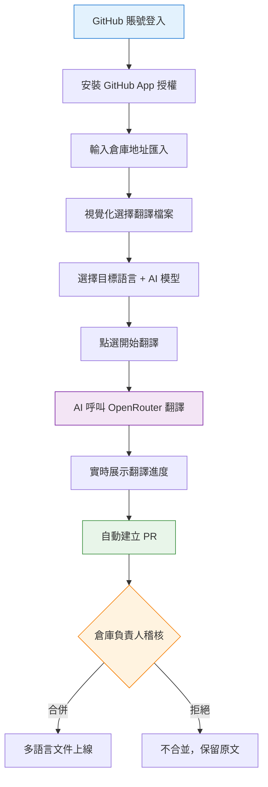

# Cursor - GitHub 文件翻譯工具專案實戰

這是一套以 AI 程式設計實戰為核心的專案教程，基於 Next.js + GitHub App + OpenRouter，用 AI 程式設計的方式從 0 到 1 開發一個《GitHub 倉庫 AI 文件翻譯 SaaS 平臺》，帶你親身體驗 Vibe Coding 的完整工作流，學會用 AI 做出真正能用、能部署、能賺錢的產品！

專案程式碼免費開源：https://github.com/liyupi/github-global

完整影片教程 + 文字教程（預計 3 ~ 5 天學完）：https://www.codefather.cn/course/2014303010343092226

專案介紹影片：https://bilibili.com/video/BV1mAAmzqEfP

## 專案介紹

魚皮開源了一套 AI 程式設計教程倉庫 [ai-guide](https://github.com/liyupi/ai-guide)，包含了上百個中文教程文件。為了讓海外使用者也能看到，想把倉庫翻譯成多語言版本，但人工翻譯成本太高，GitHub Actions 又要自己折騰配置……

既然如此，**不如做一個更通用的工具**。

這就是 GitHub Global 專案的起點：輸入任意一個 GitHub 倉庫地址，AI 自動將文件翻譯成多種語言，並在基準語言內容發生變更時自動增量同步翻譯，生成 PR 等待倉庫負責人合併，全程無需人工干預。

不需要人工翻譯、不需要配環境、不需要折騰什麼 GitHub Actions 工作流，直接在平臺上操作，輕鬆幫你的開源專案出海。

**零配置，一鍵翻譯，讓你的 GitHub 專案走向全球！**

## 專案功能演示

1）用 GitHub 賬號一鍵登入

基於 GitHub App 實現安全登入與授權，比傳統 OAuth App 許可權更細粒度，Token 1 小時自動過期，更安全。

2）匯入 GitHub 倉庫

輸入 GitHub 倉庫地址，點選匯入，平臺就會自動拉取你的倉庫資訊，方便後續配置翻譯。

3）配置翻譯，靈活選擇翻譯範圍

可以自由選擇要翻譯成哪些語言（支援英語、法語等 20 種主流語言），還能透過視覺化的檔案樹勾選要翻譯哪些文件。

4）一鍵執行翻譯，自動提交 PR

點選翻譯，AI 呼叫 OpenRouter 大模型執行翻譯任務，前端實時展示進度狀態：

翻譯完成後自動建立 GitHub 程式碼合併請求，倉庫負責人可以選擇是否合併，既方便又安全：

5）自動觸發增量翻譯

開啟「自動翻譯」開關後，每當往倉庫推送了新的文件變更，GitHub Webhook 會自動通知平臺，系統只翻譯「在翻譯範圍內且發生了變更」的檔案，省時省錢：

6）自定義大模型和 API Key

平臺預設提供了免費的 AI 翻譯額度，也可以在設定頁面配置自己的 OpenRouter API Key，從排行榜前 20 的主流大模型中自由選擇翻譯模型（支援 GPT、Claude、Gemini、DeepSeek 等）：

## 專案收穫

本專案選題新穎，緊跟 AI 程式設計時代，以真實 SaaS 產品開發為導向，區別於增刪改查的爛大街專案。你不是在寫程式碼，而是在用 AI 做一個真正有價值的產品。

專案以 Vibe Coding 為核心，99% 以上的程式碼都是 AI 寫的，主要用的是 Cursor 這款 AI 程式設計工具，搭配了 firecrawl-mcp 聯網搜尋、context7 獲取最新技術文件這兩個 MCP 擴充套件，前端頁面還用了 ui-ux-pro-max 這個 Agent Skills 來生成更精美的 UI。

整個專案累積不到 1 天就做完並且上線讓大家都能訪問了！

從這個專案中你可以學到：

- 如何用 AI 進行需求調研，生成專業的《需求規格文件》？
- 如何用多 AI 並行的方式，同時開發前端和後端？
- 如何與 GitHub App 對接，實現安全的 OAuth 授權和倉庫操作？
- 如何接入 OpenRouter，統一對接數百種 AI 大模型？
- 如何使用 GitHub API 獲取倉庫檔案樹、提交檔案、建立 PR？
- 如何透過 GitHub Webhook 實現事件驅動的自動化翻譯？
- 如何使用內網穿透工具，在本地除錯 Webhook 回撥？
- 如何用 Vercel 部署 Next.js 全棧專案，快速上線？
- 如何在 AI 開發流程中進行程式碼審查、版本控制和問題修復？
- 如何識別競品差異化機會，設計真正有競爭力的產品？

## 功能梳理

該專案功能豐富，涵蓋使用者認證、倉庫管理、翻譯配置、翻譯執行、變更同步 5 大模組，20+ 功能點，覆蓋了真實 SaaS 產品的核心業務場景。

## AI 程式設計開發流程

這個專案遵循最主流的 AI 應用開發流程：

第一步，給 AI 寫一段需求調研的提示詞，讓它聯網搜尋競品、分析差異化機會，最後生成需求規格文件。

第二步，讓 AI 設計技術方案，確定用 Next.js 全棧加 TypeScript、資料庫用 MySQL 加 Prisma、AI 接入走 OpenRouter。

第三步最關鍵，開了兩個 AI 視窗，一個寫後端、一個寫前端，後端先出介面文件給前端，兩邊並行開發。寫完了再開一個視窗專門做測試驗收和修 Bug。

跑通核心業務流程之後，就開始做各種擴充套件功能。建議每做完一個階段都用 Git 提交程式碼，防止 AI 後面亂改把專案搞崩。為了防止上下文過多導致 AI 斷片兒和浪費 Tokens，做擴充套件功能的時候按需開新的 AI 對話視窗，把需求文件、方案文件丟給 AI，再讓它分析一下已有的專案原始碼，AI 就能快速找回記憶，接著幹活。

最後透過 Vercel 一鍵部署上線，整個專案累積不到 1 天就做完並且上線了！

## 核心業務流程

使用者使用流程非常簡單：登入 GitHub 賬號 → 匯入倉庫 → 配置翻譯範圍和語言 → 一鍵翻譯 → 稽核合併 PR，幾分鐘搞定。

## 技術選型

本專案以 Next.js 全棧 + TypeScript 為核心，前後端一體，綜合運用了多種主流 SaaS 開發技術。

前後端：Next.js 15（App Router）、TypeScript、shadcn/ui + Tailwind CSS、Prisma ORM、MySQL、NextAuth.js

AI 相關：OpenRouter API 統一接入 100+ 大模型、AI 智慧翻譯、AI 分析 README 結構

GitHub 對接：GitHub App 細粒度許可權控制、GitHub REST API、GitHub Webhook、Octokit

工具和部署：Ngrok 內網穿透、Vercel 一鍵部署、Docker 容器化、Git 版本控制

AI 程式設計工具：Cursor、MCP 外掛（firecrawl-mcp + context7）、Agent Skills（ui-ux-pro-max）

## 架構設計

本專案採用 Next.js 全棧一體化架構，前後端合併在一套程式碼中，透過 API Routes 提供服務端介面，結合本地任務佇列處理耗時的翻譯任務，並對接 GitHub API 和 OpenRouter 完成核心業務。

完整影片教程 + 文字教程（預計 3 ~ 5 天學完）：https://www.codefather.cn/course/2014303010343092226

## 推薦資源

1）魚皮 AI 導航網站：[AI 資源大全、最新 AI 資訊、免費 AI 教程](https://ai.codefather.cn)

2）程式設計導航學習圈：[學習路線、程式設計教程、實戰專案、求職寶典、交流答疑](https://www.codefather.cn)

3）程式設計師面試八股文：[實習/校招/社招高頻考點、企業真題解析](https://www.mianshiya.com)

4）程式設計師寫簡歷神器：[專業模板、豐富例句、直通面試](https://www.laoyujianli.com)

5）1 對 1 模擬面試：[實習/校招/社招面試拿 Offer 必備](https://ai.mianshiya.com)

