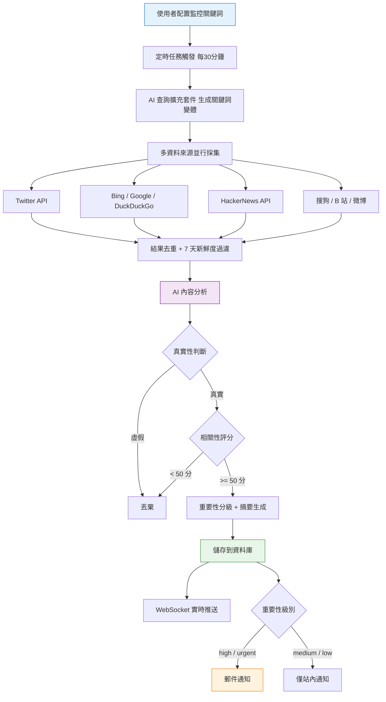

# GitHub Copilot - AI 熱點監控工具專案實戰

這是一套以 AI 程式設計實戰為核心的專案教程，基於 Express 5 + React 19 + OpenRouter + Socket.io，用 AI 程式設計的方式從 0 到 1 開發一個《AI 熱點監控工具》，帶你親身體驗 Vibe Coding 的完整工作流，學會用 AI 快速做出實用的提效工具！

專案程式碼免費開源：https://github.com/liyupi/yupi-hot-monitor

完整影片教程 + 文字教程（預計 2 ~ 5 天學完）：https://www.codefather.cn/course/2026625439052627970

## 專案介紹

魚皮作為 AI 程式設計博主，必須第一時間知道各種大模型更新、行業動態，但人工刷資訊太累了，而且經常漏掉重要內容。

有了這個專案後，只需要輸入要監控的關鍵詞（比如 "Claude"、"Vibe Coding"），點選立即掃描，系統就會自動從國內外的 B 站、Bing 等 8 個以上的資訊源幫你抓取相關內容。

抓回來之後，AI 會自動判斷資訊的真假、分析和關鍵詞的相關性、評估重要程度，還會生成中文摘要，低質量的內容直接過濾掉，只留真正有價值的熱點。

找到新熱點的時候，還會透過 WebSocket 實時推送到頁面上，重要的熱點還會發郵件通知。如果熱點太多了也沒關係，可以透過篩選和排序快速定位需要的內容。

更酷的是，整個熱點監控能力還被封裝成了一個 Agent Skills 技能包，安裝後在 Cursor、Claude Code 等各種 AI 程式設計工具中都能直接用，一句話就能幫你從全網搜尋、分析、生成熱點報告。

**讓 AI 幫你盯熱點，第一時間獲取優質資訊！**

## 專案功能演示

1）配置監控關鍵詞

使用者輸入要監控的關鍵詞，比如 "Vibe Coding"、"Claude" 等，系統會自動開始監控。支援啟用 / 暫停單個關鍵詞。

2）AI 自動抓取和分析熱點

系統每 30 分鐘自動從 Twitter、Bing、HackerNews、搜狗、B 站、微博等 8+ 個資訊源抓取內容，利用 AI 進行查詢擴充套件、真假識別、相關性分析和智慧摘要，過濾低質量內容後展示在資訊流中。

3）多維度篩選和排序

支援按資訊來源、重要性、時間範圍進行篩選，支援按熱度綜合、相關性、釋出時間排序，幫助使用者快速定位需要的熱點資訊。

4）全網搜尋

除了監控關鍵詞的實時熱點流外，還可以直接搜尋特定的關鍵詞，從全網獲取資訊：

5）實時通知

透過 WebSocket 實時推送熱點通知，高重要性的熱點還會透過郵件通知：

6）Agent Skills 技能包

將熱點監控能力封裝為標準的 Agent Skills，安裝後在 Cursor、VSCode Copilot、Claude Code 等 AI 程式設計工具中都能使用：

## 專案收穫

本專案選題新穎，緊跟 AI 程式設計時代，以實用工具開發為導向，區別於增刪改查的爛大街專案。你不是在寫程式碼，而是在用 AI 做一個真正有價值的工具。

專案以 Vibe Coding 為核心，99% 以上的程式碼都是 AI 寫的，主要用的是 VSCode + GitHub Copilot 作為 AI 程式設計工具，搭配了 Firecrawl MCP 做網頁抓取、Context7 MCP 獲取最新技術文件，前端頁面還用了 UI UX Pro Max 這個 Agent Skills 來美化，配合 Aceternity UI 元件庫做出了充滿科技感的炫酷介面。

從這個專案中你可以學到：

- 如何用 AI 程式設計從 0 到 1 開發一個完整的工具？
- 如何安裝和使用 MCP 增強 AI 能力？
- 如何安裝和使用 Agent Skills 提升 AI 程式設計質量？
- 如何從多個資訊源（Twitter、Bing、HN、B 站等）聚合抓取內容？
- 如何透過 OpenRouter 接入 AI 大模型，實現智慧內容稽核？
- 如何實現查詢擴充套件（Query Expansion），提高資訊檢索的召回率？
- 如何基於 Socket.io 實現 WebSocket 實時推送？
- 如何使用 Aceternity UI 打造炫酷的科技感前端介面？
- 如何開發標準化的 Agent Skills 技能包，並在多種 AI 工具中驗證？
- 如何在 AI 程式設計中進行人工確認、版本控制和迭代最佳化？

## 功能梳理

該專案功能豐富，涵蓋關鍵詞管理、熱點採集和分析、資訊展示和篩選、實時通知系統、全網資訊源搜尋、Agent Skills 六大模組，20+ 功能點，覆蓋了從資訊採集、AI 智慧分析到實時推送通知的完整熱點監控閉環。

## AI 程式設計開發流程

這個專案遵循最主流的 AI 程式設計專案開發流程：

第一步，給 AI 寫一段需求描述提示詞，讓它幫我設計方案。當然，如果你有自己的想法，可以適當發揮一點兒專業性，比如要利用 OpenRouter 來對接 AI 服務。

第二步，人工確認方案。包括前端、後端、資料儲存技術棧，抓取熱點資料的範圍和方法，傳送通知的方法，熱點檢查頻率等，確認沒問題後再讓 AI 動手寫程式碼。

第三步，啟動開發。AI 會先規劃任務列表，一步步完成前後端開發。

第四步，測試驗證。在環境變數檔案中配置 API 金鑰等資訊，然後啟動專案點點點~

跑通核心業務流程之後，就要持續迭代最佳化。比如先是增加了多個資訊來源，能獲取到更多國內外的資訊。然後發現獲取的資訊不準確，就設計了多層級過濾機制，並且讓 AI 加了查詢擴充套件。前端介面也從千篇一律的藍紫色最佳化成了有流星、光影效果的科技感頁面。

建議每做完一個功能就用 Git 提交程式碼，防止 AI 後面改著改著搞崩了。如果上下文太長了，AI 容易斷片兒，就新開一個對話視窗，把需求文件和方案文件丟給 AI，讓它重新分析已有程式碼找回記憶。

## 核心業務流程

整個專案的核心流程：使用者配置關鍵詞 → 定時任務觸發 → AI 查詢擴充套件 → 多源抓取 → 去重過濾 → AI 分析 → 入庫 → 實時推送 / 郵件通知。

## 技術選型

本專案以 Node.js 全棧 + TypeScript 為核心，前後端分離，涵蓋多源爬蟲資料採集、AI 大模型內容稽核、WebSocket 實時推送、定時任務排程、Aceternity UI 科技感前端、Agent Skills 開發等實用技術。

後端：Express 5、TypeScript、Prisma ORM、SQLite、Socket.io、node-cron、Nodemailer

前端：React 19、Vite 7、Tailwind CSS 4、Framer Motion、Aceternity UI 元件、Socket.io-client

資料採集：Axios + Cheerio 爬蟲、TwitterAPI.io、HackerNews API、B 站公開 API

AI 相關：OpenRouter API 統一接入多種大模型、AI 內容稽核、Query Expansion 查詢擴充套件

AI 程式設計工具：VSCode + GitHub Copilot、MCP 外掛（Firecrawl + Context7）、Agent Skills（UI UX Pro Max + Skill Creator）

## 架構設計

本專案採用前後端分離架構，前端使用 React + Vite，後端使用 Express + Prisma，透過 REST API 和 WebSocket 通訊。透過定時任務引擎來驅動多資料來源採集和 AI 分析，Agent Skills 作為獨立模組可在多種 AI 程式設計工具中複用。

完整影片教程 + 文字教程（預計 2 ~ 5 天學完）：https://www.codefather.cn/course/2026625439052627970

## 推薦資源

1）魚皮 AI 導航網站：[AI 資源大全、最新 AI 資訊、免費 AI 教程](https://ai.codefather.cn)

2）程式設計導航學習圈：[學習路線、程式設計教程、實戰專案、求職寶典、交流答疑](https://www.codefather.cn)

3）程式設計師面試八股文：[實習/校招/社招高頻考點、企業真題解析](https://www.mianshiya.com)

4）程式設計師寫簡歷神器：[專業模板、豐富例句、直通面試](https://www.laoyujianli.com)

5）1 對 1 模擬面試：[實習/校招/社招面試拿 Offer 必備](https://ai.mianshiya.com)
